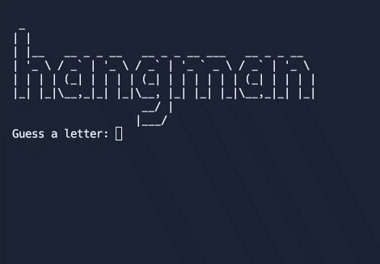

## Exercises
- Challenge 1 - Picking a Random Words and Checking Answers: https://replit.com/@itsviktoriya/Day-7-Hangman-1?v=1#main.py
- Challenge 2 - Replacing Blanks with Guesses: https://replit.com/@itsviktoriya/Day-7-Hangman-2?v=1#main.py
- Challenge 3 - Checking if the Player has Won: https://replit.com/@itsviktoriya/Day-7-Hangman-3?v=1#main.py
- Challenge 4 - Keeping Track of the Player's Lives: https://replit.com/@itsviktoriya/Day-7-Hangman-4?v=1#main.py

## Project

Challenge 5 and Finish - Improving the User Experience: https://replit.com/@itsviktoriya/Day-7-Hangman-Complete?v=1#main.py
